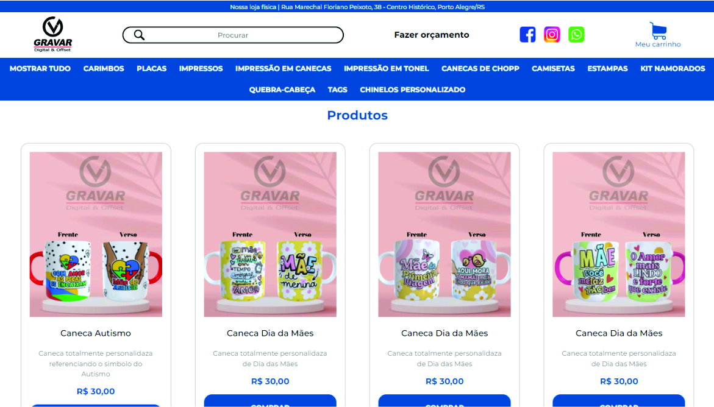
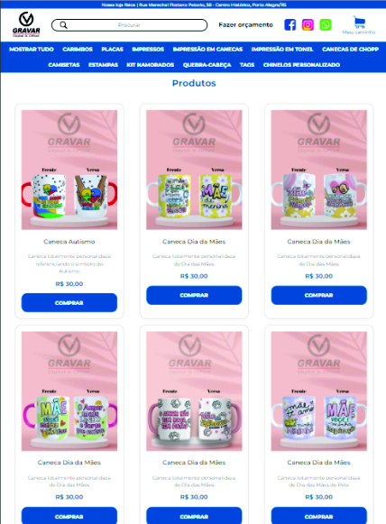
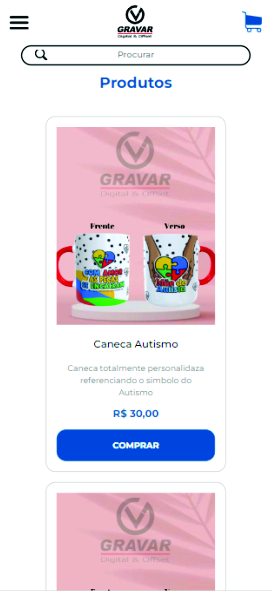

<h1>Gravar Digital</h1>

O projeto Gravar Digital existe graças a um grande amigo João proprietário desse empreendimento que me autorizou fazer um site de sua loja para usar em meu portifólio. A Gravar Digital é uma gráfica com muitas opções de presente entre canecas, camisas, impressos, carimbos, placas, kit para os namorados. Enviando para qualquer parte do Brasil você pode personalizar cada item da loja. Com opções de fazer um orçamento via email, telefone ou qualquer dúvida pode mandar mensagem pelo whatsApp para melhores esclarecimento. 

<h2>🖥️ Layout para desktop</h2>

<h2>📱 Layout para tablet</h2>

<h2>📱 Layout para mobile</h2>

<h2>Tecnologias utilizadas</h2>

<h2>Recursos do projeto</h2>

✅ Personalizado: o site foi cuidadosamente feito com imagens SVG para melhor resolução.

✅ Responsividades: O site foi cuidadosamente projetado para se adaptar de forma fluida a diferentes tamanhos de tela. Isso assegura uma experiência consistente e agradável em dispositivos móveis, tablets e desktops.

✅ Acessibilidade: Foi dada especial atenção à acessibilidade, garantindo que o site seja utilizável por todos os públicos, independentemente de suas habilidades.

<a href="#" style="background-color: grey; color: black; padding: 1rem; border-radius: 10px">Ver projeto</a>